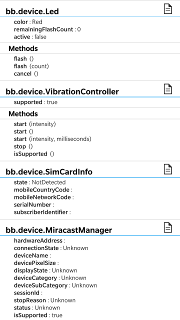

# QtBridge Sample

This application demonstrates the how to use QtBridge to expose Qt objects to javascript in a WebWorks 2.0/Cordova application. The sample application shows how to use a custom c++ module and all of the qml-exposed BlackBerry APIs in the following namespaces: bb, bb.platform, bb.device, bb.system.

**Applies To**

* [BlackBerry 10 WebWorks SDK](https://developer.blackberry.com/html5/download/sdk)
* [Apache Cordova for BlackBerry 10](https://github.com/blackberry/cordova-blackberry/tree/master/blackberry10)
  
**Author**

* [Isaac Gordezky](http://www.twitter.com/igordezky)

**Dependencies**

1. [QtBridge Native Extension](../plugin/src/blackberry10/native) is [licensed](../LICENSE) under the Apache 2.0 license.

## Screenshots ##

## Required Plugins ##

### The following Cordova Plugins are required for this sample: ###

[com.blackberry.qt](https://github.com/blackberry/WebWorks-Community-APIs/tree/master/BB10-Cordova/QtBridge)

### Creating an Object ###

The following code demonstrates how to create a qt object

    var led = blackberry.qt.createObject("bb.device.Led");
    
    console.log("Led has the following properties: " + Object.keys(led));
    
    ...
    
    // cleanup the object when you are done
    led.destroy();

### Calling a Method or Slot ###

The following code demonstrates how to call a method or slot
    
    console.log("Flashing LED 10 times");    
    led.flash(10);

### Getting and Setting Properties ###

The following code demonstrates how to set and get properties

    console.log("LED color is " + led.color);
    
    console.log("Setting LED color to blue");
    led.color = "Blue";

### Connecting to Signals ###

The following code demonstrates how connect to signals to get asynchronous callbacks from a qt object

    function ledActiveChanged(isActive) {  
        // Note: this points to the led object
        console.log(this.color + " LED is now " + isActive ? "active" : "inactivee");
    }

    var connectionId = led.activeChanged.connect(ledActiveChanged);
    
    // call flash to trigger activeChanged()
    led.flash(1);
    
    // disconnect when no longer want events
    led.activeChanged.disconnect(ledActiveChanged);
    // alternatively, disconnect by connectionId
    led.activeChanged.disconnect(connectionId);
    

## How to Build

1. Clone this repo to your local machine.

2. Ensure the [BlackBerry 10 WebWorks SDK 2.0](https://developer.blackberry.com/html5/download/sdk) is correctly installed.

3. Open a command prompt (windows) or terminal (mac/linux) and run the following command:

		webworks create <your source folder>\QtBridgeSample

4. **Replace** the default \QtBridgeSample\www folder with the \www folder from **this** project

5. **Replace** the default \QtBridgeSample\config.xml with the config.xml from **this** project

6. From the command prompt (Windows) or terminal (mac), navigate to the QtBridgeSample folder

		cd <your source folder>\QtBridgeSample

7. Run the following commands to configure plugins used by **this app**

		webworks plugin add <path to **this** project>/plugin

8. Run the following command to build and deploy the app to a device connected via USB

		webworks run

## Notes

Linux users: replace webworks with cordova in all of the above commands

## More Info

* [BlackBerry HTML5 WebWorks](https://bdsc.webapps.blackberry.com/html5/) - Downloads, Getting Started guides, samples, code signing keys.
* [BlackBerry WebWorks Development Guides](https://bdsc.webapps.blackberry.com/html5/documentation)
* [BlackBerry WebWorks Community Forums](http://supportforums.blackberry.com/t5/Web-and-WebWorks-Development/bd-p/browser_dev)
* [BlackBerry Open Source WebWorks Contributions Forums](http://supportforums.blackberry.com/t5/BlackBerry-WebWorks/bd-p/ww_con)

## Contributing Changes

Please see the [README](https://github.com/blackberry/WebWorks-Community-APIs) of the Webworks-Community-APIs repository for instructions on how to add new Samples or make modifications to existing Samples.

## Bug Reporting and Feature Requests

If you find a bug in a Sample, or have an enhancement request, simply file an [Issue](https://github.com/blackberry/BB10-WebWorks-Samples/issues) for the Sample.

## Disclaimer

THE SOFTWARE IS PROVIDED "AS IS", WITHOUT WARRANTY OF ANY KIND, EXPRESS OR IMPLIED, INCLUDING BUT NOT LIMITED TO THE WARRANTIES OF MERCHANTABILITY, FITNESS FOR A PARTICULAR PURPOSE AND NONINFRINGEMENT. IN NO EVENT SHALL THE AUTHORS OR COPYRIGHT HOLDERS BE LIABLE FOR ANY CLAIM, DAMAGES OR OTHER LIABILITY, WHETHER IN AN ACTION OF CONTRACT, TORT OR OTHERWISE, ARISING FROM, OUT OF OR IN CONNECTION WITH THE SOFTWARE OR THE USE OR OTHER DEALINGS IN THE SOFTWARE.