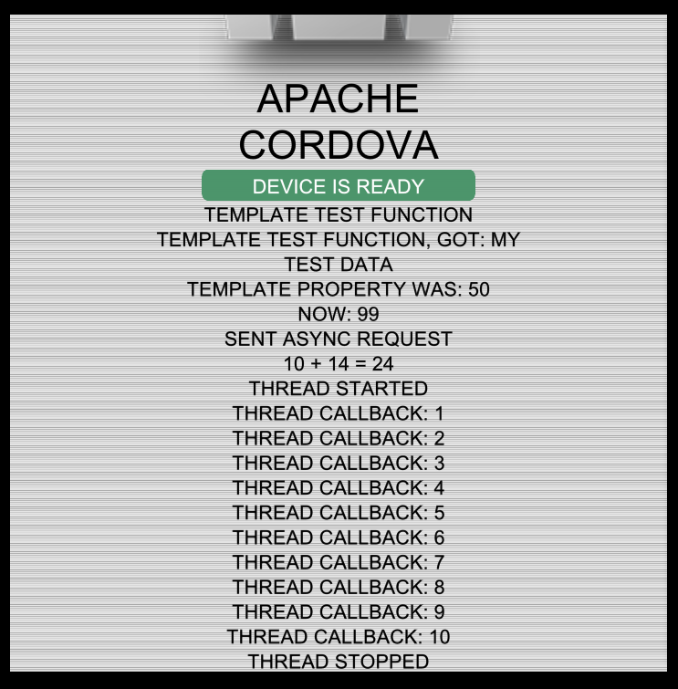

Template for BlackBerry 10 Cordova Plugins
==========================================

BlackBerry 10 Cordova Plugins create a bridge between JavaScript code in an HTML5 application and C/C++ and/or Qt code in the plugin, allowing access to native libraries, which are not part of the HTML5 specification. The BlackBerry 10 Plugins included with the Cordova SDK also follow the same or similar format as shown in this template.

Plugins offer a JavaScript API which communicates through an interface to native methods. This interface can send and receive data through strings, or data that can be represented as a string such as JSON and Base64.

This template includes examples for communicating in several ways:

1. A function that returns a string from a native method.
2. A function that sends a string to, and gets another back, from a native method.
3. A function that calls a native method with a JSON object input, and provides a callback function, which is fired by a native method, and receives JSON data.
4. Defining a property that is linked to native methods when retrieved or set.
5. Starting and Stopping a native thread, with a callback function that receives events from the native thread.

## Building and Testing the Sample

The included sample is the default Cordova Hello World application created by the __cordova create__ command. It is ready to run on your simulator simply by calling __cordova run__ in the sample directory. It has been altered to include a div in _index.html_ for displaying the test data, and a set of test functions in _js/index.js_ to excercise the template API and display some results.

To use the plugin in another project, that's been created with Cordova, run __cordova plugin add <path to this Template folder>/plugin__

Then you can call the methods with the namespace __community.templateplugin__, and that should appear in WebInspector as an Object so you can see what APIs are available. The example APIs included will be detailed later in this guide.

This is a screenshot of the test data being displayed in the Hello World sample app:


## Starting a Plugin from the Template

Copy the Template folder to a location on your computer to start working with it.

### Momentics NDK setup

You can either import the project from the Template folder, or use the New Project Wizard in Momentics to create a starter project.

#### Using the New Project Wizard

1. Open the Momentics IDE. Navigate to the workbench and from the program menu select File -> New -> New BlackBerry Project.
2. Choose Native Extension from the Project Type list, then select BlackBerry WebWorks, and click Next.
3. Change the project name to "Template" and click Finish.
4. Right click your project again and select Build Configurations -> Manage..., then click New.
5. Enter "device" for the name and choose to copy settings from Device-Release.
6. Repeat to create a configuration named "simulator", and choose to copy settings from Simulator-Debug.
7. You will need to copy the device and simulator folders to the _/plugin/src/blackberry10/native_ directory where you copied the Template, each time you build. You can configure a post build command if you'd like, in the project properties.

#### Importing the Template

1. Open the Momentics IDE. Navigate to the workbench and from the program menu
select File -> Import and choose "Existing Projects into Workspace".
2. Choose "Select root directory: " and browse to the _/plugin/src/blackberry10/native_ directory where you copied the Template. Select the Template project in the Projects list and uncheck "Copy projects into workspace". Click Finish.
3. Follow these next steps to build the template plugin to be sure the setup is working.

#### How to build your native Plugin

1. Right click your project and select the Clean Project option.
2. Right click your project again and select Build Configurations -> Build Selected... .
3. A window will appear that shows all the available build configurations
for the project. Select __device__ and __simulator__ and click ok.
4. You should see the shared libraries (libTemplate.so files) generated in the folders for each Build Configuration that you selected.

### Using the Plugin in an Application

To use the plugin in another project, that's been created with Cordova, run __cordova plugin add <path to this Template folder>/plugin__.
That will copy the plugin into the project, and update the www/config.xml file to include the feature as below:

```xml
<feature name="community.templateplugin" value="community.templateplugin" />
```

All the methods in the plugin will be prefixed by that feature name, so a method called _test()_ supplied in the _community.templateplugin_ plugin will be called in JavaScript like so:

```javascript
community.templateplugin.test();
```

Depending on the plugin, these methods can also have return values, take arguments, or supply callback methods.

To remove the plugin, run __cordova plugin rm community.templateplugin__

### Modifying the Template Plugin

#### Namespace
Choose a namespace for your application that is concise and descriptive. Use community.pluginname as the general format. Change all the occurences of the name in plugin/plugin.xml. Update the _ID variable in client.js to match the namespace.

#### JNEXT plugin files
index.js and the template_js.cpp/hpp files are linked by the name of the library and the name of the class in the library. Change the Class Name from TemplateJS to something that matches the new plugin's role. Change the project name in the NDK as well. Then you will need to update the references in index.js to match the new values:

Find self.init = function () {}, and change __libTemplate__ to the new project name, but keep the __lib__ prefix. Then change the reference to __TemplateJS__ to use the new Class Name.

```javascript
self.init = function () {
	if (!JNEXT.require("libTemplate")) {
		return false;
	}

	self.m_id = JNEXT.createObject("libTemplate.TemplateJS");

	...
};
```
#### Update .js files
There are many other places where "template" is used in file names and methods in the JavaScript files. These can be changed to better reflect the new plugin API. Note carefully where index.js calls the JNEXT.Template object so that you don't break the chain.

#### Change NDK files
In the files template_ndk.hpp and template_ndk.cpp, there are plenty of uses of "Template" and "template" which can be changed to match the new plugin.

#### Rebuild 
When making changes, rebuild regularly so you don't make a really hard to find typo.

Follow the steps above to:
1. [Build the native portion](#how-to-build-your-native-plugin), and
3. [Use the plugin in your test app](#using-the-plugin-in-an-application).

## Architecture of a Plugin

Plugins are organized into several files, each with a specific role.

1. <a href="/blackberry/WebWorks-Community-APIs/tree/master/BB10-Cordova/Template/plugin/plugin.xml">plugin.xml</a> - defines the namespace of the plugin lists the files that need to be included.
2. <a href="/blackberry/WebWorks-Community-APIs/tree/master/BB10-Cordova/Template/plugin/www/client.js">client.js</a> - the client file defines the API that can be called by an application. It calls to functions in index.js using the Cordova framework. It also connects callback functions to the events that fire them.
3. <a href="/blackberry/WebWorks-Community-APIs/tree/master/BB10-Cordova/Template/plugin/src/blackberry10/index.js">index.js</a> - This is the main controller of the plugin. It receives calls from the client.js through Cordova, and calls the appropriate methods in the included JNEXT object, which does the communication to the Native side of JNEXT.
4. <a href="/blackberry/WebWorks-Community-APIs/tree/master/BB10-Cordova/Template/plugin/src/blackberry10/native/src/template_js.hpp">template_js.hpp</a> - C++ header for the JNEXT code. You should rarely have to edit this aside from renaming.
6. <a href="/blackberry/WebWorks-Community-APIs/tree/master/BB10-Cordova/Template/plugin/src/blackberry10/native/src/template_js.cpp">template_js.cpp</a> - C++ code for the JNEXT plugin. Besides renaming, the primary editing of this will be to edit the InvokeMethod function to call the appropriate methods in template_ndk.cpp, given the command and callbackId sent in from index.js and the Template object.
7. <a href="/blackberry/WebWorks-Community-APIs/tree/master/BB10-Cordova/Template/plugin/src/blackberry10/native/src/template_ndk.hpp">template_ndk.hpp</a> - C++ header for the native code. Where you will need to list method signatures for the extenion methods called from the template_js.cpp file, and any private methods or variables.
8. <a href="/blackberry/WebWorks-Community-APIs/tree/master/BB10-Cordova/Template/plugin/src/blackberry10/native/src/template_ndk.cpp">template_ndk.cpp</a> - C++ native code. All the main native code will go here typically. 

## Communication end to end

Plugin methods can be synchronous or asynchronous, send arguments, receive return values, and provide callback methods.

In client.js we define the _ID variable for the name of the plugin, and the exec method from Cordova which will do the communication:

```javascript
var _self = {},
	_ID = "community.templateplugin",
	exec = cordova.require("cordova/exec");
```

The basic format of all cordova client-side calls is 

```javascript
exec(success, fail, pluginId, method, args);
```

In most cases, we'll define success and fail inline.

#### Synchronous Methods

a simple Synchronous method call looks like this, in client.js:

```javascript
_self.testInput = function (input) {
	var result,
		success = function (data, response) {
			result = data;
		},
		fail = function (data, response) {
			console.log("Error: " + data);
		};
	exec(success, fail, _ID, "test", { input: input });
	return result;
};
```

In index.js, the client-side call maps to 

```javascript
test: function (success, fail, args, env) {
	var result = new PluginResult(args, env);
	args = JSON.parse(decodeURIComponent(args["input"]));
	result.ok(template.getInstance().testInput(result.callbackId, args), false);
},
```
Where the success and fail callbacks were sent in from client.js, and args is an object passed in to the exec method, but it has been converted by JSON.stringify() and encoded as a URIcomponent, so you must call 

```javascript
JSON.parse(decodeURIComponent(args["input"]));
```

To communicate through Cordova, a new PluginResult is created, and we fire the result.ok method, and pass in the result of the appropriate JNEXT function. In order to handle times where there is a callback, we will always include the callbackId when sending in arguments. So, the method in the JNEXT.Template object looks like the following:

```javascript
self.testInput = function (callbackId, input) {
	return JNEXT.invoke(self.m_id, "testStringInput " + callbackId + " " + input);
};
```
Note: If input is a JSON object, we need to convert it to a string first with JSON.stringify(input).

Now the communication passes into the native layer. JNEXT.invoke eventually calls into:

```cpp
string TemplateJS::InvokeMethod(const string& command) {
	// format must be: "command callbackId params"
	size_t commandIndex = command.find_first_of(" ");
	std::string strCommand = command.substr(0, commandIndex);
	size_t callbackIndex = command.find_first_of(" ", commandIndex + 1);
	std::string callbackId = command.substr(commandIndex + 1, callbackIndex - commandIndex - 1);
	std::string arg = command.substr(callbackIndex + 1, command.length());
	// ...
	} else if (strCommand == "testStringInput") {
		return m_pTemplateController->templateTestString(arg);
	}
	//...
}
```

The method name and callbackId are stripped off the front of the command sent in, and the rest is sent in as an argument for the appropriate method. Note the use of the pointer to the TemplateNDK object, so we separate our regular native code from the JNEXT code.

Finally, we call the native method that contains the functionality we are providing to our WebWorks application, and in this example, it takes in the arguments, appends them to a string and returns the result to WebWorks.

```cpp
// Take in input and return a value
std::string TemplateNDK::templateTestString(const std::string& inputString) {
	return "Template Test Function, got: " + inputString;
}
```

If the input is a JSON object, we need to parse it first, as shown here:

```cpp
// Parse the arg string as JSON
Json::Reader reader;
Json::Value root;
bool parse = reader.parse(inputString, root);
```

To return JSON, use 

```cpp
Json::FastWriter writer;
Json::Value root;
root["result"] = "result value";
return writer.write(root);
```

#### Asynchronous Methods

An Asynchronous method will typically provide a callback function to receive the results of a method, but this is not necessarily the case for all situations. The sequence is much the same as that of Synchronous Methods with these differences:

Asynchronous method call, with both input and a callback function:

```javascript
_self.testAsync = function (input, callback) {
	var success = function (data, response) {
			var json = JSON.parse(data);
			callback(json);
		},
		fail = function (data, response) {
			console.log("Error: " + data);
		};
	exec(success, fail, _ID, "testAsync", { input: input });
};
```

In index.js we're going to keep a record of the PluginResult so we can call the callback on it later. And right now, we'll call into JNEXT for the native code, but return noResult(true) right now. The true value tells Cordova to keep our callback around.

```javascript
testAsync: function (success, fail, args, env) {
	var result = new PluginResult(args, env);
	resultObjs[result.callbackId] = result;
	args = JSON.parse(decodeURIComponent(args["input"]));
	template.getInstance().testAsync(result.callbackId, args);
	result.noResult(true);
},
```

Now the code proceeds as for Synchronous events, until the template_ndk.cpp method, where instead of returning the result directly, the NotifyEvent method is used instead, but we'll be passing in the callbackId as well this time instead of ignoring it. The callbackId is what we'll use to communicate back through JNEXT:

```cpp
// Asynchronous callback with JSON data input and output
void TemplateNDK::templateTestAsync(const std::string& callbackId, const std::string& inputString) {
	// Parse the arg string as JSON
	Json::FastWriter writer;
	Json::Reader reader;
	Json::Value root;
	bool parse = reader.parse(inputString, root);

	if (!parse) {
		Json::Value error;
		error["result"] = "Cannot parse JSON object";
		m_pParent->NotifyEvent(callbackId + " " + writer.write(error));
	} else {
		root["result"] = root["value1"].asInt() + root["value2"].asInt();
		m_pParent->NotifyEvent(callbackId + " " + writer.write(root));
	}
}
```

This event passes through the JNEXT plugin and is received on the onEvent(strData) method of the JNEXT.Template object. In the case of a standard asynchronous one-time event, we'll lookup the result and call callbackOk(data, false) so the callback is removed from Cordova, and we'll delete our record as well. However, if we need to keep that callback around for further events, we'll need some way of tracking that. In this example, there is only one callback that we need to keep around ever. :

```javascript
// Fired by the Event framework (used by asynchronous callbacks)
self.onEvent = function (strData) {
	var arData = strData.split(" "),
		callbackId = arData[0],
		result = resultObjs[callbackId],
		data = arData.slice(1, arData.length).join(" ");

	if (result) {
        if (callbackId != threadCallback) {
            result.callbackOk(data, false);
            delete resultObjs[callbackId];
        } else {
        	result.callbackOk(data, true);
        }
    }
	...
};
```

result.callbackOk(data, false) will call the success method that we registered at the beginning of the flow, in client.js.

#### Callbacks for multiple events

The Asynchronous methods above use one-time callbacks to receive their results. Sometimes it is important to receive multiple events on a callback, such as when listening to a thread or longer process.

This is done as above, simply retaining our PluginResult registry until we don't need it any longer, and if necessary, we can return a value immediately but also keep the callback as so:

```javascript
startThread: function (success, fail, args, env) {
	var result = new PluginResult(args, env);
	if (!threadCallback) {
		threadCallback = result.callbackId;
		resultObjs[result.callbackId] = result;
		result.ok(template.getInstance().startThread(result.callbackId), true);
	} else {
		result.error(template.getInstance().startThread(result.callbackId), false);
	}
},
```
At the native layer, the NotifyEvent method can be called multiple times and be received by the callback in this way. The same success method will get called for the immediate result, and all the subsequent callbacks.

#### Defining Properties

Properties can be defined on the plugin so that code like:

```javascript
community.templateplugin.templateProperty;
```

returns a value, and it can be set by the following code:

```javascript
community.templateplugin.templateProperty = value;
```

The following code defines a property called templateProperty, backed by the plugin method of the same name for setting or retrieving the value. The getter or setter could be removed to restrict what the property responds to.

```javascript
Object.defineProperty(_self, "templateProperty", {
	get: function () {
		var result,
			success = function (data, response) {
				result = data;
			},
			fail = function (data, response) {
				console.log("Error: " + data);
			};
		exec(success, fail, _ID, "templateProperty", null);
		return result;
	},
	set: function (arg) {
		var result,
			success = function (data, response) {
				result = data;
			},
			fail = function (data, response) {
				console.log("Error: " + data);
			};
		exec(success, fail, _ID, "templateProperty", {"value": arg });
		return result;
	}
});
```

The property calls are the same as synchronous calls, but are adapted to handle both input and no input on the same function in index.js:

```javascript
templateProperty: function (success, fail, args, env) {
	var result = new PluginResult(args, env);
	var value;
	if (args && args["value"]) {
        value = JSON.parse(decodeURIComponent(args["value"]));
		template.getInstance().templateProperty(result.callbackId, value);
        result.noResult(false);
    } else {
        result.ok(template.getInstance().templateProperty(), false);
    }
},
```

## Debugging

Debugging plugins is difficult, but there are some ways that can be effective. If you open WebInspector to the __first__ WebView, instead of the second, you will be able to see and interact with the index.js code and the inner parts of the extension. Opening a tab on the __second__ WebView, where you normally would, at the same time will allow you to inspect the whole flow of calls within JavaScript.

Simple JavaScript alerts also work in the plugin files and this can be invaluable to check the value of some data being passed around. Since plugins deal with strings, it's easy to check.

### Common Issues
If you are getting a message saying the application can not load your .so file, it's nearly always a linking problem. Your code may build in the IDE, but not actually link on the device. Make sure you've included all your dependencies and includes properly, _on the build that you have loaded_. Also, make sure that you've loaded the device build on a device, and the simulator on a simulator.

If your application launches but quickly freezes and then is closed, you may be using a BPS API but haven't called

```cpp
bps_initialize();
```

It is required for things like LED, Vibration, Audio and many others. See [more information here](http://developer.blackberry.com/native/reference/bb10/com.qnx.doc.bps.lib_ref/com.qnx.doc.bps.lib_ref/topic/bps_initialize.html).

## Disclaimer

THE SOFTWARE IS PROVIDED "AS IS", WITHOUT WARRANTY OF ANY KIND, EXPRESS OR IMPLIED, INCLUDING BUT NOT LIMITED TO THE WARRANTIES OF MERCHANTABILITY, FITNESS FOR A PARTICULAR PURPOSE AND NONINFRINGEMENT. IN NO EVENT SHALL THE AUTHORS OR COPYRIGHT HOLDERS BE LIABLE FOR ANY CLAIM, DAMAGES OR OTHER LIABILITY, WHETHER IN AN ACTION OF CONTRACT, TORT OR OTHERWISE, ARISING FROM, OUT OF OR IN CONNECTION WITH THE SOFTWARE OR THE USE OR OTHER DEALINGS IN THE SOFTWARE.
