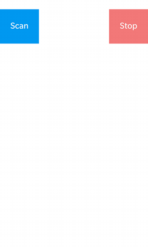
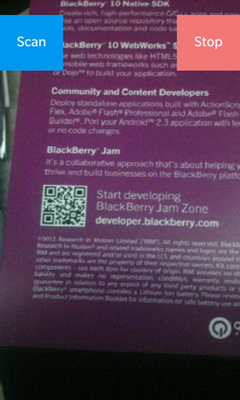
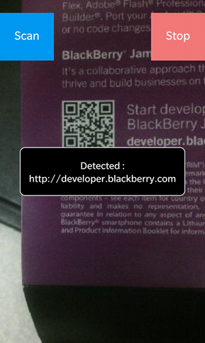
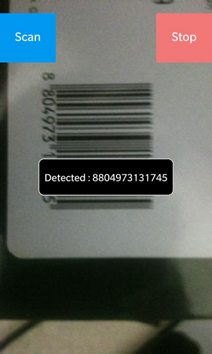
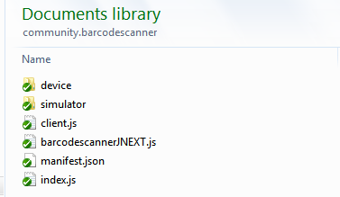

Barcode Scanner
===============

This BlackBerry 10 WebWorks extension scans all types of barcodes supported by the [ZXing](https://github.com/blackberry/zxing) library. The Rear Camera is used and it paints a viewfinder onto a Canvas for the user to target the barcode.

** Tested On **

BlackBerry 10 Dev Alpha B 10.0.10.263

BlackBerry Z10 10.1.0.1622

BlackBerry Q10 10.1.0.1020

** Authors **

[Tim Windsor](https://github.com/timwindso)

[Alex Kwan](https://github.com/greentea0)

[Mike Delong](https://github.com/mdelong)

## Building and Testing the Sample

1. Deploy the extension into your BB10 WebWorks SDK by copying the community.barcodescanner folder from the ext folder to the Framework/ext folder in your WebWorks SDK, or run the Ant build script in the /ext folder to do so.
2. Package the sample in the sample\_application folder. Use the [Ant Build Script](https://github.com/blackberry/BB10-WebWorks-Community-Samples/tree/master/Ant-Build-Script), or you can do this with the WebWorks packager command:
	__bbwp__ sample\_application -g _signingpassword_
3. Load it on your phone using the Ant Build Script, or with the _blackberry-deploy_ command found in the dependencies/tools folder of your WebWorks SDK.
4. When the application runs, two buttons will appear on a white background. Press Scan to start scanning, and the background becomes a viewfinder. Press Stop to stop scanning. If a barcode is detected, a toast will appear with the data. To Scan 1D barcodes (ie UPC product codes) you will have to turn so the lines are horizontal as shown below.

 &nbsp;
 &nbsp;
 &nbsp;


## Including the feature in your application
This feature depends on the blackberry.io feature as well, so both must be included in your applications config.xml file. Also, permission for the camera and shared filesystem is required.
```xml
<feature id="blackberry.io" />
<feature id="community.barcodescanner" />

<rim:permissions>
	<rim:permit>use_camera</rim:permit>
	<rim:permit>access_shared</rim:permit>
</rim:permissions>
```

It's also recommended that you stop scanning if the app goes into the background. To respond to app state, include the following feature:
```xml
<feature id="blackberry.app" />
```

## The Extension API
The Barcode Scanner Extension provides the following API:

```javascript
	// Start Scanning for Barcodes
	// "myCanvas" is the ID of a Canvas element for displaying the viewfinder
	// the viewfinder will be resized to the size of the Canvas given
	community.barcodescanner.startRead(codeFound, errorFound, "myCanvas", onStartRead);

	function errorFound(data){
		console.log("Error : "+data.error + " description : "+ data.description);
	}

	function codeFound(data) {
		if (gotCode === false) {
			gotCode = true;
			stopBarcodeRead();
			blackberry.ui.toast.show("Detected : "+data.value);
		}
	}

	function onStartRead(data){
		console.log("Started : "+data.successful);
	}

	// Stop Scanning for Barcodes
	community.barcodescanner.stopRead(onStopRead, errorFound);

	function onStopRead(data){
		console.log("Stopped : " +data.successful);
	}
```

## Known Issues and Implementation Details

1D Barcodes like UPC product codes need to be scanned with the bar lines running horizontally, so the code looks something like a stack of paper.

There are two parts to this Barcode Scanner - 1. Scanning camera frames for Barcodes, and 2. Showing the user what they are aiming at.
The first part works identically to any native implementation and takes advantage of BlackBerry 10's capabilities with the camera, continuous macro focus, and high speed barcode interpretation.

The second part is a little trickier.
It's not possible to send video data from the viewfinder through to the webview directly. In native barcode scanners, the viewfinder is able to paint right onto it's own window, but that approach is not possible in WebWorks. Instead, the camera is operated in burst mode and frames are captured at 1/3rd the speed of the barcode scanning. These frames are scaled down, rotated as necessary, and saved to the filesystem. Then the WebWorks side of the extension is notified of the file path so it can load the image and paint it to a Canvas. These images are slightly delayed, lower quality, and at a reduced framerate from native video solutions, so be forewarned that the solution does not compare well. Scanning for a very long time time or repeatedly scanning does seem to use up device memory, so there's also some optimization to be done yet.

## Building the extension from source

Copy the extension folder to a location on your computer to start working with it.

### Momentics NDK setup

1. Open the Momentics IDE. Navigate to the workbench and from the program menu
select File -> Import and choose "Existing Projects into Workspace".
2. Choose "Select root directory: " and browse to the NDK_project directory where you copied the extension. Select the BarcodeScanner project in the Projects list and uncheck "Copy projects into workspace". Click Finish.
3. Follow these next steps to build the extension to be sure the setup is working.

#### How to build your native Extension</a>

1. Right click your project and select the Clean Project option.
2. Right click your project again and select Build Configurations -> Build Selected... .
3. A window will appear that shows all the available build configurations
for the project. Select Device-Release and Simulator-Debug and click ok.
4. You should see the shared libraries generated in the folders for each Build Configuration that you selected.
5. Copy the .so file(s) to the device and simulator folders under the ext/community.barcodescanner directory. Or you can use the Ant build script to do so.

### Copying the Extension to the SDK</a>

1. Under the ext folder in this project should be the community.barcodescanner folder with the following file structure underneath it:



If you wish to do the copying manually, continue with these steps:

2. The device and simulator folders should contain the libBarcodeScanner.so files built by the NDK.
3. Copy the community.barcodescanner folder into your WebWorks SDK, placing it in the Framework/ext directory.

If you have Ant installed and would like to use the build script provided, edit the script as follows (you will find it in the /ext directory, called [build.xml](https://github.com/blackberry/WebWorks-Community-APIs/tree/master/BB10/BarcodeScanner/ext/build.xml) ).

1. Change the project name to match the extension name in manifest.json.
2. Change the bbwp.native.dir value to match the SDK you want to deploy to.
3. Type ant at a command prompt while in the /ext directory of the Extension. 

The build script will clean any old extension from your SDK, copy the .so files build by the NDK into the correct locations, and finally copy the whole extension into the SDK.

### Using the Extension in an Application</a>

With the extension copied into your WebWorks SDK as explained above, you can use it in your applications by referencing it as a feature in your config.xml file. 

```xml
<feature id="community.barcodescanner" />
```

All the methods in the extension will be prefixed by that feature id, so a method called startRead() supplied in the community.barcodescanner extension will be called in JavaScript like so:

```javascript
community.barcodescanner.startRead(codeFound, errorFound, "myCanvas", onStartRead);
```

### Modifying the Extension

See the examples in the [Template Extension](https://github.com/blackberry/WebWorks-Community-APIs/blob/master/BB10/Template) for how to add additional features to this extension

#### Rebuild 
When making changes, rebuild regularly so you don't make a really hard to find typo.

Follow the steps above to:

1. [Build the native portion](#how-to-build-your-native-extension),
2. [Copy the extension to your SDK](#copying-the-extension-to-the-sdk), and
3. [Use the extension in your test app](#using-the-extension-in-an-application).


**To contribute code to this repository you must be [signed up as an official contributor](http://blackberry.github.com/howToContribute.html).**

## Disclaimer

THE SOFTWARE IS PROVIDED "AS IS", WITHOUT WARRANTY OF ANY KIND, EXPRESS OR IMPLIED, INCLUDING BUT NOT LIMITED TO THE WARRANTIES OF MERCHANTABILITY, FITNESS FOR A PARTICULAR PURPOSE AND NONINFRINGEMENT. IN NO EVENT SHALL THE AUTHORS OR COPYRIGHT HOLDERS BE LIABLE FOR ANY CLAIM, DAMAGES OR OTHER LIABILITY, WHETHER IN AN ACTION OF CONTRACT, TORT OR OTHERWISE, ARISING FROM, OUT OF OR IN CONNECTION WITH THE SOFTWARE OR THE USE OR OTHER DEALINGS IN THE SOFTWARE.