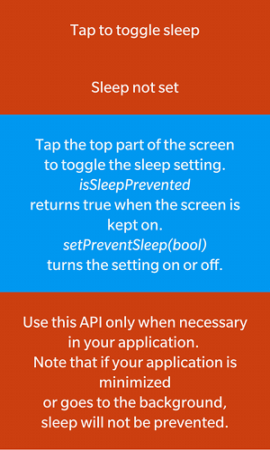
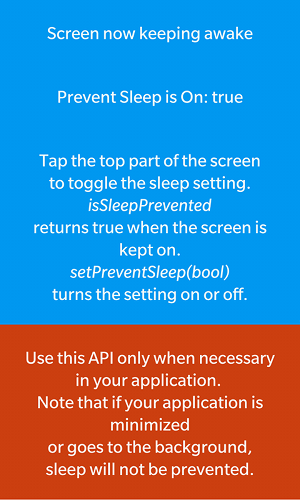
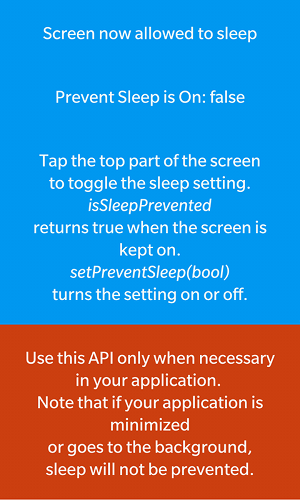
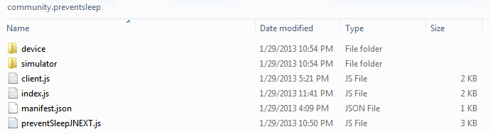

Prevent Sleep
==================

This BlackBerry 10 WebWorks extension keeps the screen from dimming while the application is in the foreground. It can be turned on or off and a property is set that is _true_ when sleep is being prevented, and _false_ otherwise.

** Tested On **

BlackBerry 10 Dev Alpha B 10.0.10.261

** Author **

[Tim Windsor](https://github.com/timwindsor)

## Building and Testing the Sample

1. Deploy the extension into your BB10 WebWorks SDK by copying the community.preventsleep folder from the ext folder to the Framework/ext folder in your WebWorks SDK, or run the Ant build script in the /ext folder to do so.
2. Package the sample in the sample\_application folder. Use the [Ant Build Script](https://github.com/blackberry/BB10-WebWorks-Community-Samples/tree/master/Ant-Build-Script), or you can do this with the WebWorks packager command:
	__bbwp__ sample\_application -g _signingpassword_
3. Load it on your phone using the Ant Build Script, or with the _blackberry-deploy_ command found in the dependencies/tools folder of your WebWorks SDK.
4. When the application runs, a series of divs on the screen will appear with an orange background, tapping the top div will toggle prevent sleep on and off. When sucessful calls to the extension of any type occur, the div backgrounds will change to blue as the screenshots below.

 &nbsp;
 &nbsp;


## Including the feature in your application
Whenever you use the below feature id in any of your WebWorks applications this extension will be loaded for use.
```xml
<feature id="community.preventsleep" required="true" version="1.0.0.0" />
```

## The Extension API
The Prevent Sleep Extension provides the following API:

```javascript
var setting = true; // boolean
var result = community.preventsleep.setPreventSleep(setting);
// Result is a string value for debugging

var currentSetting = community.preventsleep.isSleepPrevented;
// boolean value for the state of the screen
```

## Building the extension from source

Copy the extension folder to a location on your computer to start working with it.

### Momentics NDK setup

1. Open the Momentics IDE. Navigate to the workbench and from the program menu
select File -> Import and choose "Existing Projects into Workspace".
2. Choose "Select root directory: " and browse to the NDK_project directory where you copied the extension. Select the PreventSleep project in the Projects list and uncheck "Copy projects into workspace". Click Finish.
3. Follow these next steps to build the extension to be sure the setup is working.

#### How to build your native Extension</a>

1. Right click your project and select the Clean Project option.
2. Right click your project again and select Build Configurations -> Build Selected... .
3. A window will appear that shows all the available build configurations
for the project. Select Device-Release and Simulator-Debug and click ok.
4. You should see the shared libraries generated in the folders for each Build Configuration that you selected.
5. Copy the .so file(s) to the device and simulator folders under the ext/community.preventsleep directory. Or you can use the Ant build script to do so.

### Copying the Extension to the SDK</a>

1. Under the ext folder in this project should be the community.preventsleep folder with the following file structure underneath it:



If you wish to do the copying manually, continue with these steps:

2. The device and simulator folders should contain the libPreventSleep.so files built by the NDK.
3. Copy the community.preventsleep folder into your WebWorks SDK, placing it in the Framework/ext directory.

If you have Ant installed and would like to use the build script provided, edit the script as follows (you will find it in the /ext directory, called [build.xml](https://github.com/blackberry/WebWorks-Community-APIs/tree/master/BB10/PreventSleep/ext/build.xml) ).

1. Change the project name to match the extension name in manifest.json.
2. Change the bbwp.native.dir value to match the SDK you want to deploy to.
3. Type ant at a command prompt while in the /ext directory of the Extension. 

The build script will clean any old extension from your SDK, copy the .so files build by the NDK into the correct locations, and finally copy the whole extension into the SDK.

### Using the Extension in an Application</a>

With the extension copied into your WebWorks SDK as explained above, you can use it in your applications by referencing it as a feature in your config.xml file. 

```xml
<feature id="community.preventsleep" />
```

All the methods in the extension will be prefixed by that feature id, so a method called setPreventSleep() supplied in the community.preventsleep extension will be called in JavaScript like so:

```javascript
community.preventsleep.setPreventSleep(true);
```

### Modifying the Extension

See the examples in the [Template Extension](https://github.com/blackberry/WebWorks-Community-APIs/blob/master/BB10/Template) for how to add additional features to this extension

#### Rebuild 
When making changes, rebuild regularly so you don't make a really hard to find typo.

Follow the steps above to:
1. [Build the native portion](#how-to-build-your-native-extension),
2. [Copy the extension to your SDK](#copying-the-extension-to-the-sdk), and
3. [Use the extension in your test app](#using-the-extension-in-an-application).


**To contribute code to this repository you must be [signed up as an official contributor](http://blackberry.github.com/howToContribute.html).**

## Disclaimer

THE SOFTWARE IS PROVIDED "AS IS", WITHOUT WARRANTY OF ANY KIND, EXPRESS OR IMPLIED, INCLUDING BUT NOT LIMITED TO THE WARRANTIES OF MERCHANTABILITY, FITNESS FOR A PARTICULAR PURPOSE AND NONINFRINGEMENT. IN NO EVENT SHALL THE AUTHORS OR COPYRIGHT HOLDERS BE LIABLE FOR ANY CLAIM, DAMAGES OR OTHER LIABILITY, WHETHER IN AN ACTION OF CONTRACT, TORT OR OTHERWISE, ARISING FROM, OUT OF OR IN CONNECTION WITH THE SOFTWARE OR THE USE OR OTHER DEALINGS IN THE SOFTWARE.

[](https://github.com/igrigorik/ga-beacon)