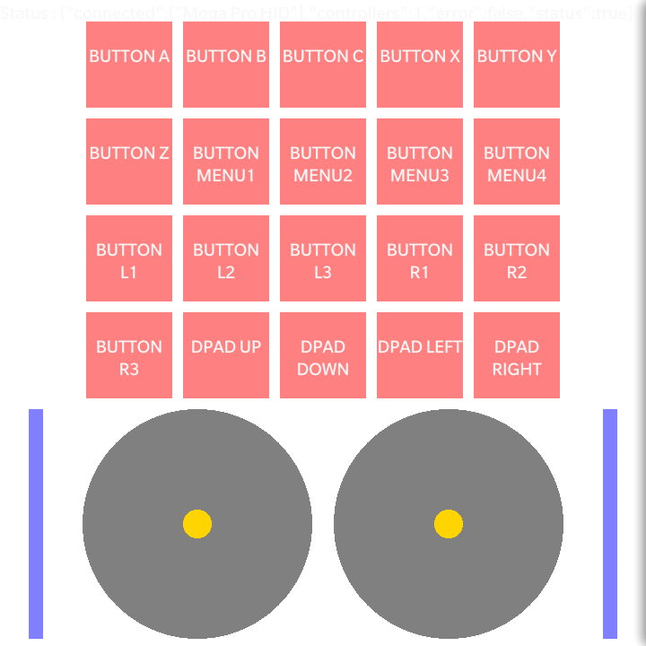

Joypad Extension
================

This BlackBerry 10 WebWorks extension adds support for joypads

### Tested On

BlackBerry 10 Dev Alpha C 10.1.0.4211

BlackBerry Z10 10.2.1.2943

### Authors

[Peardox](http://supportforums.blackberry.com/t5/user/viewprofilepage/user-id/325249)

[Tim Windsor](https://github.com/timwindsor)

## Building and Testing the Sample

1. Deploy the extension into your BB10 WebWorks SDK by copying the community.joypad folder from the ext folder to the Framework/ext folder in your WebWorks SDK, or run the Ant build script in the /ext folder to do so.
2. Package the sample in the sample\_application folder. Use the [Ant Build Script](https://github.com/blackberry/BB10-WebWorks-Community-Samples/tree/master/Ant-Build-Script), or you can do this with the WebWorks packager command:
	__bbwp__ sample\_application -g _signingpassword_
3. Load it on your phone using the Ant Build Script, or with the _blackberry-deploy_ command found in the dependencies/tools folder of your WebWorks SDK.
4. When the application runs the screen pictured below will appear. Joypad button presses and movements will be reflected in the demo.

* If a controller is connected or disconnected, the list will update.



## Including the feature in your application
Whenever you use the below feature id in any of your WebWorks applications this extension will be loaded for use.
```xml
	<feature id="community.joypad" required="true" version="1.0.0.0" />
	<rim:permissions>
		<rim:permit>use_gamepad</rim:permit>
	</rim:permissions>
	
```

## The Extension API
The Joypad Extension works as a shim for the [HTML5 Gamepad API](http://www.w3.org/TR/2014/WD-gamepad-20140225/).

You will need to wait for the "webworksready" event as it depends on WebWorks being loaded, but after that, follow the standard for getting Gamepad data.

Listen to the window for "gamepadconnected" and "gamepaddisconnected" events:

```
window.addEventListener('gamepadconnected',function(event) {
	console.log("Gamepad was connected: " + event.gamepad);
	updateGamepadList();
});
window.addEventListener('gamepaddisconnected',function(event) {
	console.log("Gamepad was disconnected: " + event.gamepad);
	updateGamepadList();
});

```

Read controller values from the navigator.getGamepads() method. It's recommended that you do so on AnimationFrame updates like so:

```
function readGamepads() {
	window.requestAnimationFrame(readGamepads);
	if (!navigator.getGamepads) {
		return;
	}
	var gamepads = navigator.getGamepads();
	if (gamepads) {
		for (var i = 0; i<gamepads.length; i++) {
			readGamepad(gamepads[i]);
		}
	}
}
```

The Gamepad object follows the spec as close as possible:

* id: The descriptive name of the controller, or the raw id values if it's not a known controller
* index: The index of the controller in the list of connected controllers (up to 2 are supported)
* connected: true if the controller is still connected
* timestamp: an increasing counter updated every time a new update is received from the controller
* mapping: always the empty string as this extension sends the raw hardware mapping without doing any remapping
* buttons[]: an array of the button values. Each takes the format: { "pressed" : true/false, "value": 1.0/0.0 }
* axes[]: an array of all the axes the controller supports. Some Analog buttons can appear here. Format is a value from -1.0 -> 1.0

As this extension is a shim for the HTML5 spec, if you code your application to work based on this implementation, it should be highly portable and automatically work if at some point the Browser engine gets native support.

## Building the extension from source

Copy the extension folder to a location on your computer to start working with it.

### Momentics NDK setup

1. Open the Momentics IDE. Navigate to the workbench and from the program menu
select File -> Import and choose "Existing Projects into Workspace".
2. Choose "Select root directory: " and browse to the NDK_project directory where you copied the extension. Select the joypad project in the Projects list and uncheck "Copy projects into workspace". Click Finish.
3. Follow these next steps to build the extension to be sure the setup is working.

#### How to build your native Extension</a>

1. Right click your project and select the Clean Project option.
2. Right click your project again and select Build Configurations -> Build Selected... .
3. A window will appear that shows all the available build configurations
for the project. Select Device-Release and Simulator-Debug and click ok.
4. You should see the shared libraries generated in the folders for each Build Configuration that you selected.
5. Copy the .so file(s) to the device and simulator folders under the ext/community.joypad directory. Or you can use the Ant build script to do so.

### Copying the Extension to the SDK</a>

1. Under the ext folder in this project should be the community.joypad folder:

If you wish to do the copying manually, continue with these steps:

2. The device and simulator folders should contain the libjoypad.so files built by the NDK.
3. Copy the community.joypad folder into your WebWorks SDK, placing it in the Framework/ext directory.

If you have Ant installed and would like to use the build script provided, edit the script as follows (you will find it in the /ext directory, called [build.xml](https://github.com/blackberry/WebWorks-Community-APIs/tree/master/BB10/joypad/ext/build.xml) ).

1. Change the project name to match the extension name in manifest.json.
2. Change the bbwp.native.dir value to match the SDK you want to deploy to.
3. Type ant at a command prompt while in the /ext directory of the Extension. 

The build script will clean any old extension from your SDK, copy the .so files build by the NDK into the correct locations, and finally copy the whole extension into the SDK.

### Using the Extension in an Application</a>

With the extension copied into your WebWorks SDK as explained above, you can use it in your applications by referencing it as a feature in your config.xml file. 

```xml
<feature id="community.joypad" />
```

This extension starts itself automatically in order to implement the HTML5 spec.

**To contribute code to this repository you must be [signed up as an official contributor](http://blackberry.github.com/howToContribute.html).**

## Disclaimer

THE SOFTWARE IS PROVIDED "AS IS", WITHOUT WARRANTY OF ANY KIND, EXPRESS OR IMPLIED, INCLUDING BUT NOT LIMITED TO THE WARRANTIES OF MERCHANTABILITY, FITNESS FOR A PARTICULAR PURPOSE AND NONINFRINGEMENT. IN NO EVENT SHALL THE AUTHORS OR COPYRIGHT HOLDERS BE LIABLE FOR ANY CLAIM, DAMAGES OR OTHER LIABILITY, WHETHER IN AN ACTION OF CONTRACT, TORT OR OTHERWISE, ARISING FROM, OUT OF OR IN CONNECTION WITH THE SOFTWARE OR THE USE OR OTHER DEALINGS IN THE SOFTWARE.